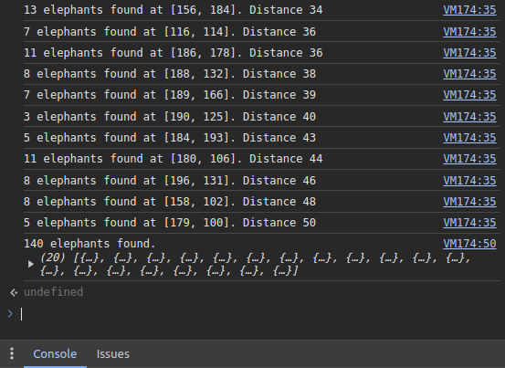

# Travian Elephant Finder

A script that automatically locates elephants around your village in the game Travian.

### How cages work

You capture nature troops in order of strength, so you will capture a rat, then a snake, then a bear, then a tiger, then a elephant if those were the animals in a oasis, and the cycle repeats until the hero runs out of cages. When you attack an oasis with a hero who has traps equipped, he will not fight the troops he doesn't capture.

This script calculates the score of each oasis based on the animals in it. The score shows the total strength of the captured animals if you use all your cages. For best results, adjust your cages so the last captured animal is an elephant.

## Other tools

[🌾 Travian Crop Finder](https://github.com/kaareloun/travian-crop-finder)

[🐘 Travian Elephant Finder](https://github.com/kaareloun/travian-elephant-finder)

## How to use

- Login to Travian
- Open chrome console (ctrl + shift + j)
- Paste the following code, change `CONFIG` and press enter

```javascript
var CONFIG = {
  village: {
    x: 150,
    y: 150,
  },
  searchRadius: 30,
  cages: 5,
};
var results = [];
var animalPattern = (animal) =>
  new RegExp(`title=\"${animal}\"/></td>\n\\s*<td class=\"val\">(\\d+)</td>`);
var ANIMALS = {
  'Rat': 25,
  'Spider': 35,
  'Snake': 40,
  'Bat': 66,
  'Wild Boar': 70,
  'Wolf': 80,
  'Bear': 140,
  'Crocodile': 380,
  'Tiger': 170,
  'Elephant': 440,
};
var promises = [];
for (let r = 1; r <= CONFIG.searchRadius; r++) {
  for (let dx = -r; dx <= r; dx++) {
    for (let dy = -r; dy <= r; dy++) {
      if (Math.abs(dx) !== r && Math.abs(dy) !== r) {
        continue;
      }
      const promise = new Promise(async (resolve) => {
        const x = CONFIG.village.x + dx;
        const y = CONFIG.village.y + dy;
        const response = await fetch(
          `${window ? window.location.origin : `https://${CONFIG.server}`}/api/v1/map/tile-details`,
          {
            method: 'POST',
            headers: {
              'Content-Type': 'application/json',
              'Cookie': document ? document.cookie : process.env.AUTH_TOKEN || '',
            },
            body: JSON.stringify({ x, y }),
          }
        );
        const responseData = await response.json();
        const animalsArray = Object.keys(ANIMALS).reduce((acc, animal) => {
          const match = animalPattern(animal).exec(responseData.html);
          acc[animal] = match ? Array.from({ length: Number(match[1]) }) : [];
          return acc;
        }, {});
        const elephantsArray = animalsArray['Elephant'] || [];
        if (elephantsArray.length > 0) {
          let score = 0;
          let animalIndex = 0;
          let cagesLeft = CONFIG.cages;
          while (cagesLeft > 0) {
            if (Object.keys(animalsArray).length === 0) {
              break;
            }
            const animal = Object.keys(animalsArray)[animalIndex];
            if (animalsArray[animal]?.length === 0) {
              delete animalsArray[animal];
              continue;
            }
            if ((animalsArray[animal]?.length || 0) > 0) {
              score += ANIMALS[animal];
              animalsArray[animal]?.pop();
              cagesLeft--;
            }
            animalIndex = (animalIndex + 1) % Object.keys(animalsArray).length;
          }
          console.log(`Elephants found at [${x}, ${y}]. Distance: ${r}. Score: ${score}.`);
          results.push({ x, y, distance: r, score });
        }
        resolve(null);
      });
      promises.push(promise);
      if (promises.length >= 10) {
        await Promise.all(promises);
        promises = [];
      }
    }
  }
}
await Promise.all(promises);
console.log(
  `${results.length} oasis found.`,
  results.sort((a, b) => b.score - a.score)
);
```

## Screenshots



## Using locally

```
git clone git@github.com:kaareloun/travian-elephant-finder.git
cd travian-elephant-finder
echo "AUTH_COOKIE=cookie" > .env
bun install
bun run main.ts
```
