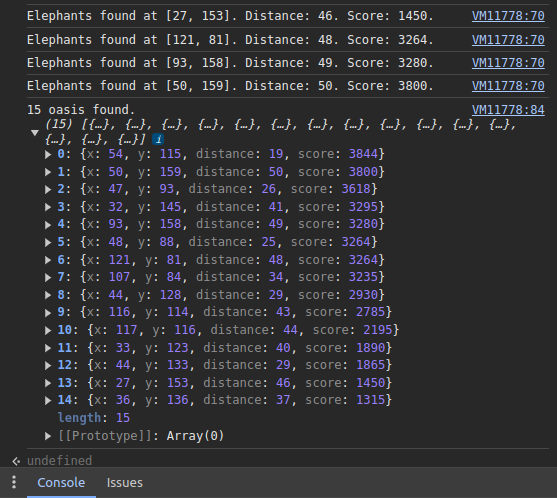

# Travian Elephant Finder

A script that automatically locates elephants around your village in the game Travian.

## Other tools

[🌾 Travian Crop Finder](https://github.com/kaareloun/travian-crop-finder)

[🐘 Travian Elephant Finder](https://github.com/kaareloun/travian-elephant-finder)

## How to use

- Login to Travian
- Open chrome console (ctrl + shift + j)
- Paste the following code, change `CONFIG` and press enter

```javascript
var CONFIG = {
  village: {
    x: 150,
    y: 150,
  },
  searchRadius: 50,
  types: [9, 15],
};
var results = [];
var cropTilePattern = new RegExp(
  `title="Crop"></i></td>\\s*<td class="val">(${CONFIG.types.join('|')})</td>`
);
var promises = [];
for (let r = 1; r <= CONFIG.searchRadius; r++) {
  for (let dx = -r; dx <= r; dx++) {
    for (let dy = -r; dy <= r; dy++) {
      if (Math.abs(dx) !== r && Math.abs(dy) !== r) {
        continue;
      }
      const promise = new Promise(async (resolve) => {
        const x = CONFIG.village.x + dx;
        const y = CONFIG.village.y + dy;
        const response = await fetch(
          `${window ? window.location.origin : `https://${CONFIG.server}`}/api/v1/map/tile-details`,
          {
            method: 'POST',
            headers: {
              'Content-Type': 'application/json',
              'Cookie': document ? document.cookie : process.env.AUTH_TOKEN || '',
            },
            body: JSON.stringify({ x, y }),
          }
        );
        const responseData = await response.json();
        const match = cropTilePattern.exec(responseData.html);
        if (match) {
          const size = match[1];
          console.log(`${size}-cropper found at [${x}, ${y}]. Distance ${r}`);
          results.push({ x, y, distance: r, size });
        }
        resolve(null);
      });
      promises.push(promise);
      if (promises.length >= 10) {
        await Promise.all(promises);
        promises = [];
      }
    }
  }
}
await Promise.all(promises);
console.log(`${results.length} villages found.`, results);
```

## Screenshots



## Using locally

```
git clone git@github.com:kaareloun/travian-crop-finder.git
cd travian-crop-finder
echo "AUTH_COOKIE=cookie" > .env
bun install
bun run main.ts
```
